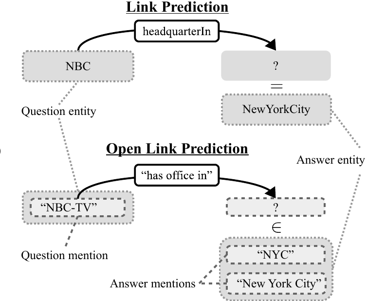

# Can We Predict New Facts with Open Knowledge Graph Embeddings? A Benchmark for Open Link Prediction

This repository contains the code for the ACL 2020 paper [**"Can We Predict New Facts with Open Knowledge Graph Embeddings? A Benchmark for Open Link Prediction"**](https://www.aclweb.org/anthology/2020.acl-main.209/). The code provides the means to train open knowledge graph embeddings and the code that was used to create the benchmark OLPBENCH. The code is provided as a documentation for the paper and also for follow-up research.

# <p align="center">  </p>

The content of this page covers the following topics: 

1. [Preparation and Installation](#preparation-and-installation)
2. [Training an Open Knowledge Graph Embedding Model on OLPBENCH](#training)
3. [Create OLPBENCH from scratch](#create-olpbench-from-scratch)


## Preparation and Installation 

- The project is installed as follows:

    ```
    git clone https://github.com/samuelbroscheit/open_knowledge_graph_embeddings.git
    cd open_link_prediction_benchmark
    pip install -r requirements.txt
    ```

- Add paths to environment

    ```
    source setup_paths
    ```

- Download OLPBENCH

    Download the full dataset (compressed: ~ 2.4 GB, uncompressed: ~ 7.9 GB)

    ```
    cd data
    wget http://data.dws.informatik.uni-mannheim.de/olpbench/olpbench.tar.gz
    tar xzf olpbench.tar.gz
    cd ..
    ```


## Training

Once preparation and installation are finished you can train a model on OLPBENCH. 

1. [Run training](#run-training)
2. [Prepared configurations](#prepared-configurations)
3. [Models](#models)

### Run training

Run the training with:

```  
python scripts/train.py [TRAIN_CONFIG_YAML] [OPTIONS] 
```  

TRAIN_CONFIG_YAML is a yaml config file. The possible options are documented in:

[openkge/default.yaml](openkge/default.yaml)

All top level options can also be set on the command line and override the yaml confguration.

If you run training on a dataset the first time some indexes will be created and cached. For OLPBENCH this can take around 30 minutes and up to 10-20 GB of main memory! After the cached files are created the startup takes under 1 minute. 

For example, a working command to train is:

```
python scripts/train.py config/acl2020-openlink/wikiopenlink-thorough-complex-lstm.yaml
```

_--resume_ expects the path to a checkpoint file. Checkpoints of the current state and also the best model(s) w.r.t. a model selection metric are saved during training within _data/experiments_ by default. If you are resuming from a checkpoint, note that the number of _epochs_ in the config needs to be more than the number of epochs the checkpoint was already trained for (and not the extra number of epochs). You can set the _--epochs_ and _--resume_ on command line or set them manually in the config file. 

The output log file is present in the model's _data/experiments_ subdirectory. Each _resume_ creates a new log file in the same directory.

##### Prepared configurations
    
A token-based model for the OLPBench benchmark.

- [config/acl2020-openlink/wikiopenlink-thorough-complex-lstm.yaml](config/acl2020-openlink/wikiopenlink-thorough-complex-lstm.yaml) is a configuration to train a OpenKGE model on the open link benchmark data.


Two example models for the the Freebase FB15k-237 benchmark. Suggested for prototyping token based models.

- [config/fb15k237/fb15k237-complex-lstm.yaml](config/fb15k237/fb15k237-complex-lstm.yaml)  

- [config/fb15k237/fb15k237-complex-unigrampool.yaml](config/fb15k237/fb15k237-complex-unigrampool.yaml) 


An example standard KGE model for the the Freebase FB15k-237 benchmark.

- [config/fb15k237/fb15k237-complex-kge.yaml](config/fb15k237/fb15k237-complex-kge.yaml) 


### Run evaluation

Run evaluation after training on test data with:

```  
python scripts/train.py config/acl2020-openlink/wikiopenlink-thorough-complex-lstm.yaml --resume data/experiments/.../checkpoint.pth.tar --evaluate True --evaluate_on_validation False
```  

_--evaluate_on_validation False_ sets the evaluation to run on test data


### Models

See [openkge/model.py](openkge/model.py)

##### Lookup based models (standard KGE)

-    LookupTucker3RelationModel 
-    LookupDistmultRelationModel
-    LookupComplexRelationModel

##### Token based model to compute the entity and relation embeddings by pooling token embeddings

-    UnigramPoolingComplexRelationModel

##### Token based model to compute the entity and relation embeddings with a sliding window CNN

-    BigramPoolingComplexRelationModel 

##### Token based model to compute the entity and relation embeddings with a LSTM

-    LSTMDistmultRelationModel 
-    LSTMComplexRelationModel
-    LSTMTucker3RelationModel

##### Diagnostic models

-    DataBiasOnlyEntityModel 
-    DataBiasOnlyRelationModel 


For model options see the init of the respective class in [openkge/model.py](openkge/model.py). Additional to the combinations above, new combinations of score and embedding functions can be easily created by:

```  
class BigramPoolingDistmultRelationModel(DistmultRelationScorer, BigramPoolingRelationEmbedder):

    def __init__(self, **kwargs):
        super().__init__(**kwargs)
```  


    
## Create OLPBENCH from scratch

*ONLY if you want to create OLPENCH or a variant of it from scratch! This takes around half a day and a lot of memory to run. Best setting is at minimum a 40 core machine with at least 64GB of free main memory.*

Download the OPIEC clean dataset (compressed: ~ 35 GB, uncompressed: ~ 292.4 GB)

```
cd data
wget http://data.dws.informatik.uni-mannheim.de/opiec/OPIEC-Clean.zip
unzip OPIEC-Clean.zip
cd ..
```

Then download and start an Elasticsearch server, that should listen on localhost:9200 . This is usually as easy as downloading the most recent version, unzip it in some folder, then change the default configuration to

```
cluster node.local: true # disable network
```

and then start the server in with ./bin/elasticsearch. Then run the preprocessing with 

```
python scripts/create_data.py -c config/preprocessing/prototype.yaml
```

##### Prepared configurations to create OLPBENCH from scratch
    

- [config/preprocessing/prototype.yaml](config/preprocessing/prototype.yaml) a configuration for prototyping the pipeline

- [config/preprocessing/acl2020.yaml](config/preprocessing/acl2020.yaml) the configurations with the settings from the ACL2020 study


## Use this code for experiments on FB15k237

##### Prepare data

```  
cd data/fb15k237
python prepare_fb237.py
```  

##### Prepared configurations

A token-based model:

- [config/fb15k237/fb15k237-complex-lstm.yaml](config/fb15k237/fb15k237-complex-lstm.yaml) is a configuration to train a OpenKGE model on FB15k237 using token descriptions of the data.

- [config/fb15k237/fb15k237-complex-kge.yaml](config/fb15k237/fb15k237-complex-kge.yaml) is a configuration to train a OpenKGE model on FB15k237 using standard KGE lookup embeddings of the data.

## FAQ

##### What is the meaning of the prefixes for some relation tokens?

This is additional information about how a triple was extracted. For example, *has:impl_poss-clause* was extracted from a sentence which did not explicitly say "New York has a mayor ...", but from a implicit possessive relation, similar to a construction in "New York's mayor ...". OLPBENCH is based on OPIEC (https://openreview.net/forum?id=HJxeGb5pTm) which was created with the system MINIE (see Implicit extractions in https://aclanthology.org/D17-1278.pdf), which uses the patterns described in FINET (https://aclanthology.org/D15-1103.pdf). Check out the last two papers to learn more about the implicit extractions that can occur in this dataset. Some of those patterns can be noisy and therefore might require special treatment, which is why this information is present in the data. For instance, for the evaluation data we chose the heuristic to sample only from relations with three or more words. This automatically excluded some implicit extractions for evaluation. If a model cannot handle this additional information then a simple approach is to just ignore everything after the colon. In our work we treated *has:impl_poss-clause* as a different token from *has*.

## Citation

if you find this code useful for your research please cite 

```
@inproceedings{broscheit-etal-2020-predict,
    title = "Can We Predict New Facts with Open Knowledge Graph Embeddings? A Benchmark for Open Link Prediction",
    author = "Broscheit, Samuel  and
      Gashteovski, Kiril  and
      Wang, Yanjie  and
      Gemulla, Rainer",
    booktitle = "Proceedings of the 58th Annual Meeting of the Association for Computational Linguistics",
    month = jul,
    year = "2020",
    address = "Online",
    publisher = "Association for Computational Linguistics",
    url = "https://www.aclweb.org/anthology/2020.acl-main.209",
    doi = "10.18653/v1/2020.acl-main.209",
    pages = "2296--2308",
}
```
